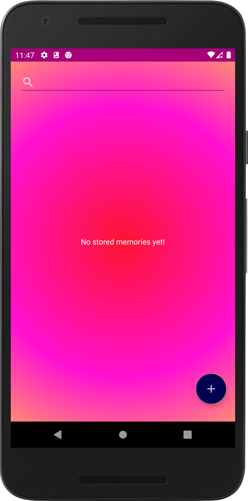
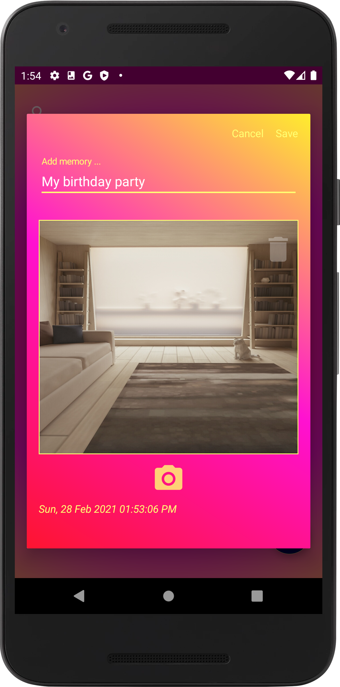
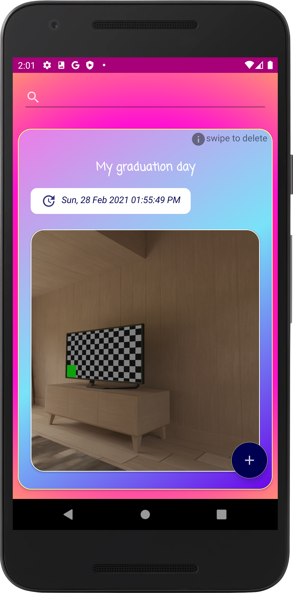
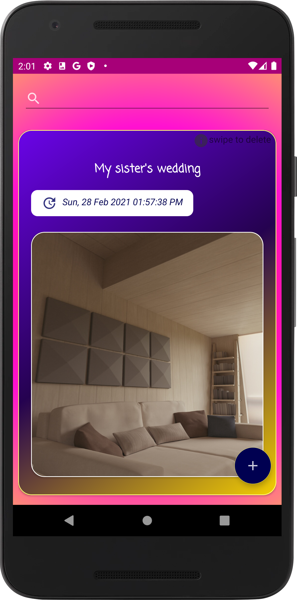
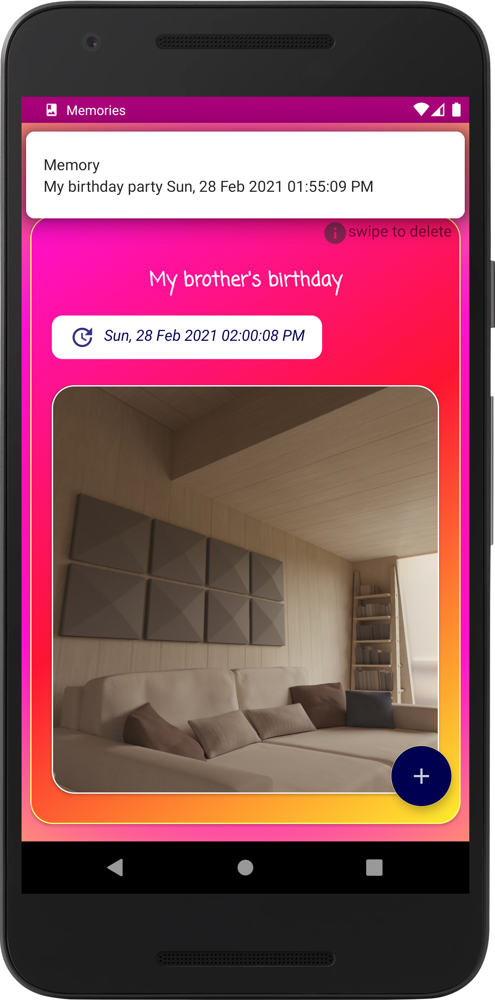
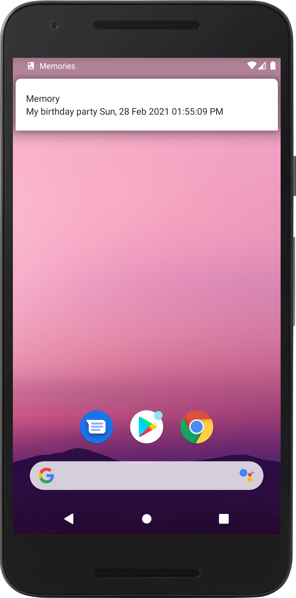
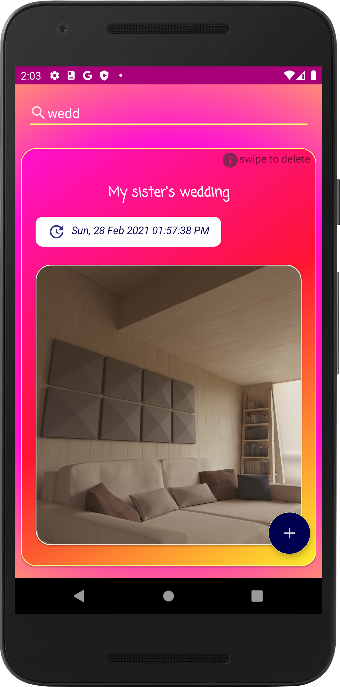
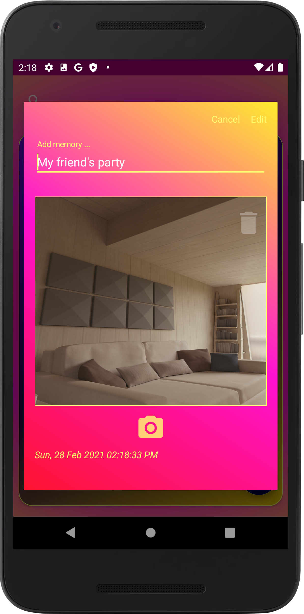
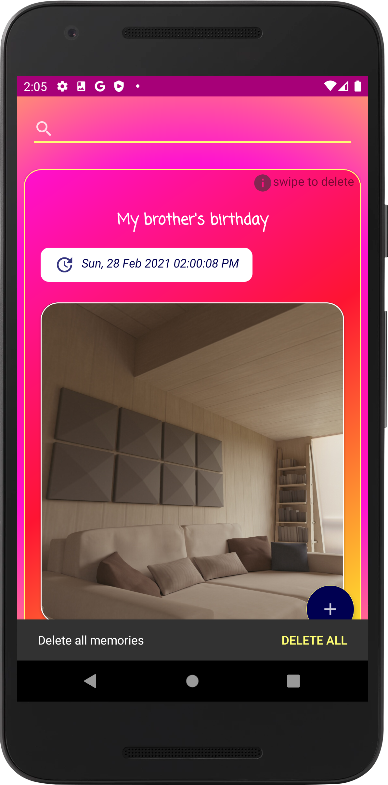

# Memories app

  This program helps the user to keep the details of the events he attends, the occasion, its date and the place in which it was held.
  The program stores all this in the ROOM.
  24 hours after, the event turns into a memory. 
  Whenever the user passes the place where the event was held within a circumference of 500 meters, a notification appears that reminds him of it.
  The app enable the user to add, edit, delete and search his memories.

 
 
 

 
 
 

 

 App notify you whenever you pass the place where the event was held within a circumference of 500 meters 

 

 

 App allows you to search your memories 

 

 You can edit your stored memories 

 

 Swipe to delete specific memory or tap DELETE ALL to remove all stored ones 

